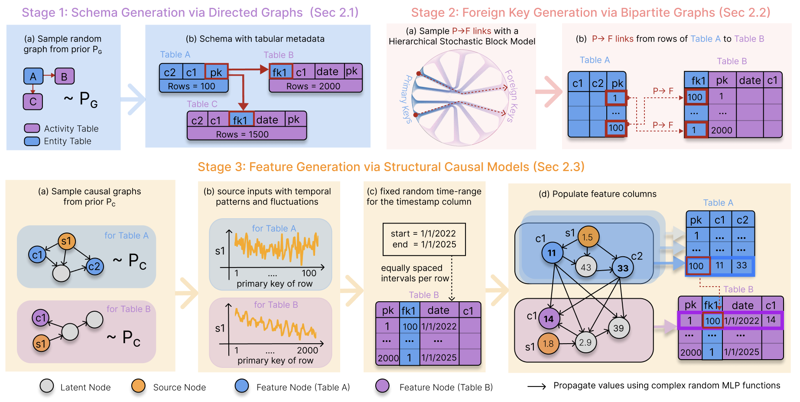

<div align="center">
  <h1>PluRel</h1>
  <p>
Synthetic Data unlocks Scaling Laws for Relational Foundation Models
</p>

</div>
<br>

This repository provides a reference implementation for the paper [PluRel: Synthetic Data unlocks Scaling Laws for Relational Foundation Models](https://arxiv.org/abs/2602.04029).

## Overview

PluRel is a framework for synthesizing relational databases using Structural Causal Models (SCMs). This repository provides:

- Generation of synthetic relational databases (from scratch or from SQL schemas) compatible with [relbench](https://github.com/snap-stanford/relbench).
- Scalable multi-processing data generation.
- High-performance context sampling via a Rust-based sampler (rustler).
- Pretraining of relational transformers on synthetic data.

## Framework Design




## Setup

Setup the environment with [pixi](https://pixi.sh/latest/installation/)

```bash
# setup pixi environment
$ pixi install

# Compile and install the rust sampler
$ cd rustler && pixi run maturin develop --uv --release && cd ..

# Run tests
$ pixi run pytest

# Lint and format code
$ pixi run ruff check .
$ pixi run ruff format .
```


## Synthesize Relational Data from Scratch

- The `SyntheticDataset` class can be used to create [relbench](https://github.com/snap-stanford/relbench) compatible dataset objects.
- It only requires a `seed` and a `Config` object that contains `database`, `scm` and `dag` level params for sampling. See example below.

```py
from plurel import SyntheticDataset, Config

# create relbench compatible dataset
dataset = SyntheticDataset(seed=0, config=Config())

# create database which can be cached via relbench APIs
db = dataset.make_db()
```

### Configuration

The `Config` class controls all aspects of synthetic database generation through three parameter groups:

| Parameter Group | Description |
|-----------------|-------------|
| `DatabaseParams` | Table layout (`BarabasiAlbert`, `ReverseRandomTree`, `WattsStrogatz`), number of tables, row counts, column counts, and timestamp ranges. |
| `SCMParams` | SCM graph layouts, column types, MLP initialization, activation functions, noise distributions, and time-series trend/cycle parameters. |
| `DAGParams` | DAG-specific parameters like edge dropout, in-degree limits, and rewiring probabilities for different graph types. |

```py
from plurel import Config, DatabaseParams, SCMParams

config = Config(
    database_params=DatabaseParams(num_tables_choices=Choices(kind="range", value=[5, 10])),
    schema_file="path/to/schema.sql",  # optional: generate from SQL schema
    cache_dir="~/.cache/plurel",       # optional: cache generated databases
)
```

### Scalable Generation

We also provide a multiprocessing-based script to generate databases in parallel.

```bash
$ pixi run python scripts/synthetic_gen.py \
    --seed_offset 0 \
    --num_dbs 1000 \
    --num_proc 16 \
    --preprocess
```

| Argument | Description |
|----------|-------------|
| `--seed_offset` | Seed offset for database generation. DBs will be named `rel-synthetic-<seed>`. |
| `--num_dbs` | Number of databases to generate. |
| `--num_proc` | Number of parallel processes (default: number of CPU cores). |
| `--preprocess` | Run preprocessing and embedding steps. Omit to skip. |

> [!NOTE]
> Checkout notebooks in `examples/` for synthesizing from SQL schemas


## Download Preprocessed Data

The preprocessed synthetic data is available on the Hugging Face Hub at [kvignesh1420/plurel](https://huggingface.co/datasets/kvignesh1420/plurel/tree/main).

1. Install the HuggingFace CLI (if not present)
```bash
pixi add huggingface_hub
```

2. Create the destination
```bash
mkdir -p ~/scratch/pre
```

3. Download the repository contents into ~/scratch/pre
```bash
pixi run hf download kvignesh1420/plurel \
    --repo-type dataset \
    --local-dir ~/scratch/pre
```

The preprocessed relbench data is available on the Hugging Face Hub at [hvag976/relational-transformer](https://huggingface.co/datasets/hvag976/relational-transformer/tree/main).

```bash
pixi run hf download hvag976/relational-transformer \
    --repo-type dataset \
    --local-dir ~/scratch/pre
```

## Download Synthetic Pretrained Checkpoints

The synthetic pretrained model checkpoints are hosted on the Hugging Face Hub at [kvignesh1420/relational-transformer-plurel](https://huggingface.co/kvignesh1420/relational-transformer-plurel/tree/main).

```bash
$ mkdir -p ~/scratch/rt_hf_ckpts

$ pixi run hf download kvignesh1420/relational-transformer-plurel \
    --repo-type model \
    --local-dir ~/scratch/rt_hf_ckpts
```

One of the downloaded checkpoints will be listed as:

```bash
$ ls ~/scratch/rt_hf_ckpts

# model pretrained on a dataset of size 4B tokens curated from 1024 synthetic RDBs
synthetic-pretrain_rdb_1024_size_4b.pt
```

## Pretraining Experiments

- Baseline (real-world) pretraining on relbench datasets with a randomly initialized relational-transformer (RT) model.

```bash
$ pixi run torchrun --standalone --nproc_per_node=1 scripts/baseline_pretrain.py
```

- Synthetic pretraining on varying number of databases and dataset sizes with a randomly initialized RT model.

```bash
$ pixi run torchrun --standalone --nproc_per_node=1 scripts/synthetic_pretrain.py
```

- Continued pretraining on relbench datasets using the synthetic pretrained models. For faster experimentation, the downloaded models from huggingface (stored in `~/scratch/rt_hf_ckpts`) can be passed to the `load_ckpt_path` argument in the training script.

```bash
$ pixi run torchrun --standalone --nproc_per_node=1 scripts/cntd_pretrain.py
```

## Citation

If you find this work useful, please cite our paper:

```bibtex
@misc{kothapalli2026plurelsyntheticdataunlocks,
      title={PluRel: Synthetic Data unlocks Scaling Laws for Relational Foundation Models},
      author={Vignesh Kothapalli and Rishabh Ranjan and Valter Hudovernik and Vijay Prakash Dwivedi and Johannes Hoffart and Carlos Guestrin and Jure Leskovec},
      year={2026},
      eprint={2602.04029},
      archivePrefix={arXiv},
      primaryClass={cs.DB},
      url={https://arxiv.org/abs/2602.04029},
}
```
