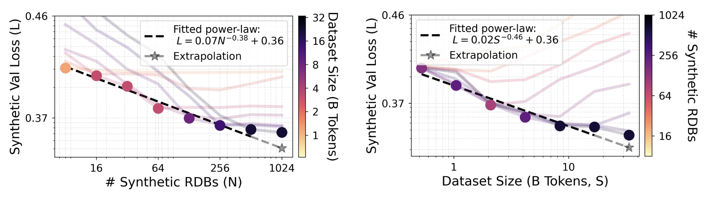

<div align="center">
  <h1>PluRel</h1>
  <p>
Synthetic Data unlocks Scaling Laws for Relational Foundation Models
</p>

[](https://star-project.stanford.edu/plurel)
[](https://arxiv.org/abs/2602.04029)
[](https://pypi.org/project/plurel/)


</div>
<br>

## Latest Updates

- [07/2026] Released **v1.1.0** on [PyPI](https://pypi.org/project/plurel/) with the latest features and performance improvements.
- [04/2026] PluRel is accepted to **ICML 2026!**

## Overview

PluRel is a framework for synthesizing diverse multi-tabular relational databases using Structural Causal Models (SCMs). It is the reference implementation for the [PluRel paper](https://arxiv.org/abs/2602.04029), with architecture and training code building on [Relational Transformer](https://github.com/snap-stanford/relational-transformer) ([ICLR 2026](https://arxiv.org/abs/2510.06377)).

This repository provides:

- Scalable generation of synthetic relational data (from scratch or SQL schemas) compatible with [relbench](https://github.com/snap-stanford/relbench).
- High-performance context sampling via a Rust-based sampler (rustler).
- Pretraining of relational transformers on synthetic data.

## Framework Design


## Installation

To use PluRel as a library:

```bash
pip install plurel
```

Requires Python 3.12+. This installs the synthetic database generator only; the Rust context sampler and training scripts under `rt/` are part of the development setup below.

> [!NOTE]
> Development moves on `main` ahead of tagged releases. If you need features or fixes that have not yet been published to PyPI, install from source using the setup below.

## Setup

For development, testing, or running the pretraining scripts, set up the full environment with [pixi](https://pixi.sh/latest/installation/).

```bash
# setup pixi environment
$ pixi install

# Compile and install the rust sampler
$ cd rustler && pixi run maturin develop --uv --release && cd ..

# Run tests
$ pixi run pytest

# Lint and format code
$ pixi run ruff check .
$ pixi run ruff format .

# Install pre-commit hooks
$ pixi run pre-commit install
```


## Synthesize Relational Data from Scratch

- The `SyntheticDataset` class can be used to create [relbench](https://github.com/snap-stanford/relbench) compatible dataset objects.
- It only requires a `seed` and a `Config` object that contains `database`, `scm` and `dag` level params for sampling. See example below.

```py
from plurel import SyntheticDataset, Config

# create relbench compatible dataset
dataset = SyntheticDataset(seed=0, config=Config())

# create database which can be cached via relbench APIs
db = dataset.make_db()
```

### Configuration

The `Config` class controls all aspects of synthetic database generation through three parameter groups:

| Parameters | Description |
|-----------------|-------------|
| `DatabaseParams` | Table layout (`BarabasiAlbert`, `ReverseRandomTree`, `WattsStrogatz`), number of tables, row counts, column counts, and timestamp ranges. |
| `SCMParams` | SCM graph layouts, column types, MLP initialization, activation functions, noise distributions, and time-series trend/cycle parameters. |
| `DAGParams` | DAG-specific parameters like edge dropout, in-degree limits, and rewiring probabilities for different graph types. |

```py
from plurel import Config, DatabaseParams, SCMParams

config = Config(
    database_params=DatabaseParams(num_tables_choices=Choices(kind="range", value=[5, 10])),
    schema_file="path/to/schema.sql",  # optional: generate from SQL schema
    cache_dir="~/.cache/relbench",       # optional: cache generated databases
)
```

### Scalable Generation

We also provide a multiprocessing-based script to generate databases in parallel.

```bash
$ pixi run python scripts/synthetic_gen.py \
    --seed_offset 0 \
    --num_dbs 1000 \
    --num_proc 16 \
    --preprocess
```

| Argument | Description |
|----------|-------------|
| `--seed_offset` | Seed offset for database generation. DBs will be named `plurel-<seed>` (override with `--db_prefix`). |
| `--num_dbs` | Number of databases to generate. |
| `--num_proc` | Number of parallel processes (default: number of CPU cores). |
| `--preprocess` | Run preprocessing and embedding steps. Omit to skip. |
| `--pre_dir` | Output directory for preprocessed data (default: `~/scratch/pre`). |

> [!NOTE]
> See [`examples/generation/`](examples/generation/) for a notebook that synthesizes from a SQL schema.


## Preprocessed Data

Preprocessed data lives on the Hugging Face Hub and is **downloaded automatically on demand** — every `pre_dir` argument in the training/eval code accepts either a local path or a Hub repo spec `org/repo[/subdir]`. Only the files needed for the requested databases are fetched and cached.

- Preprocessed relbench databases: [stanford-star/relbench-preprocessed](https://huggingface.co/datasets/stanford-star/relbench-preprocessed) (the default `pre_dir`).
- Preprocessed PluRel synthetic databases: [stanford-star/plurel-preprocessed](https://huggingface.co/datasets/stanford-star/plurel-preprocessed) (the default `synthetic_pre_dir`).

No manual download is needed; to use locally generated/preprocessed data instead, pass a local directory (e.g. `~/scratch/pre`) as `pre_dir` / `synthetic_pre_dir`.

## Download Synthetic Pretrained Checkpoints

The synthetic pretrained model checkpoints are hosted on the Hugging Face Hub at [stanford-star/rt-plurel](https://huggingface.co/stanford-star/rt-plurel/tree/main).

```bash
$ mkdir -p ~/scratch/rt_hf_ckpts

$ pixi run hf download stanford-star/rt-plurel \
    --repo-type model \
    --local-dir ~/scratch/rt_hf_ckpts
```

One of the downloaded checkpoints will be listed as:

```bash
$ ls ~/scratch/rt_hf_ckpts

# model pretrained on a dataset of size 4B tokens curated from 1024 synthetic RDBs
synthetic-pretrain_rdb_1024_size_4b.pt
```

## Run Inference on Your Own Database

Use a pretrained PluRel checkpoint to make predictions on **your own** relational
database (DuckDB, Postgres, or MySQL). The guided walkthrough in
[`examples/inference/`](examples/inference/) takes you from a SQL database to scored
predictions in three steps — you edit one config file and run three scripts:

```bash
# (optional) build a tiny demo DuckDB so you can try the flow first
$ pixi run python examples/inference/make_demo_duckdb.py

$ pixi run python examples/inference/1_data_prep.py   # convert your DB to RelBench format
$ pixi run python examples/inference/2_task_prep.py   # define the prediction task
$ pixi run python examples/inference/3_predict.py     # download the model, predict, and score
```

Point it at your own data by editing [`examples/inference/config.py`](examples/inference/config.py)
(connection URI, table schema, and the prediction task), then rerun the three steps.
Step 3 downloads the checkpoint from the Hugging Face Hub, preprocesses the data, runs
inference on the test split, and reports the metric (AUROC / MAE). See the
[walkthrough README](examples/inference/README.md) for details.

Requires the [Setup](#setup) environment (including the compiled Rust sampler).

> [!NOTE]
> Postgres and MySQL are read through SQLAlchemy — install the matching driver
> (`psycopg2-binary` or `pymysql`). DuckDB files are read natively. Add `--device cpu`
> to step 3 to run without a GPU, or set `CHECKPOINT` in `config.py` to use a local
> checkpoint instead of downloading.

## Pretraining Experiments

- Baseline (real-world) pretraining on relbench datasets with a randomly initialized relational-transformer (RT) model.

```bash
$ pixi run torchrun --standalone --nproc_per_node=1 scripts/baseline_pretrain.py
```

- Synthetic pretraining on varying number of databases and dataset sizes with a randomly initialized RT model.

```bash
$ pixi run torchrun --standalone --nproc_per_node=1 scripts/synthetic_pretrain.py
```

- Continued pretraining on relbench datasets using the synthetic pretrained models. For faster experimentation, the downloaded models from huggingface (stored in `~/scratch/rt_hf_ckpts`) can be passed to the `load_ckpt_path` argument in the training script.

```bash
$ pixi run torchrun --standalone --nproc_per_node=1 scripts/cntd_pretrain.py
```

## Citation

If you find this work useful, please cite our paper:

```bibtex
@inproceedings{kothapalli2026plurel,
title={PluRel: Synthetic Data unlocks Scaling Laws for Relational Foundation Models},
author={Vignesh Kothapalli and Rishabh Ranjan and Valter Hudovernik and Vijay Prakash Dwivedi and Johannes Hoffart and Carlos Guestrin and Jure Leskovec},
booktitle={Forty-third International Conference on Machine Learning},
year={2026}
}
```

If you use the architecture, training loop or sampler code, please also cite the Relational Transformer paper:
```bibtex
@inproceedings{ranjan2026relationaltransformer,
    title={{Relational Transformer:} Toward Zero-Shot Foundation Models for Relational Data}, 
    author={Rishabh Ranjan and Valter Hudovernik and Mark Znidar and Charilaos Kanatsoulis and Roshan Upendra and Mahmoud Mohammadi and Joe Meyer and Tom Palczewski and Carlos Guestrin and Jure Leskovec},
    booktitle={The Fourteenth International Conference on Learning Representations},
    year={2026}
}
```
